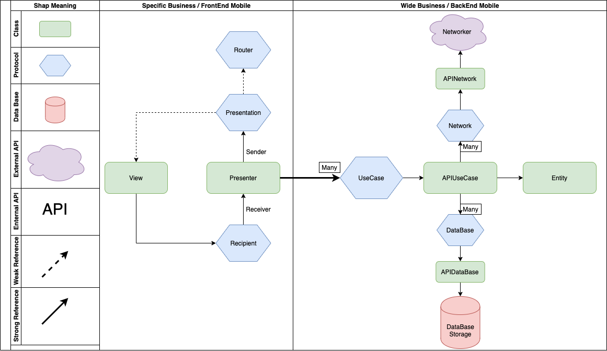
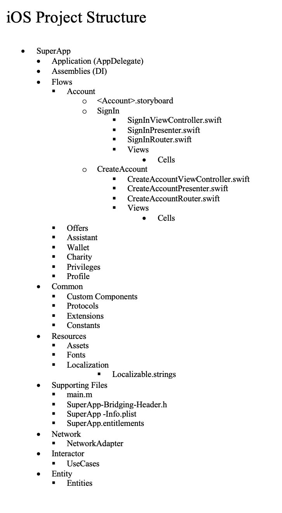

### High Level Layers

#### VIPER Concepts

##### Presentation Logic
* `View` - delegates user interaction events to the `Presenter` and displays data passed by the `Presenter`
	* All `UIViewController`, `UIView`, `UITableViewCell` subclasses belong to the `View` layer
	* Usually the view is passive / dumb - it shouldn't contain any complex logic
	* Do not write UI in code. Write as less code as possible
* `Presenter` - contains the presentation logic and tells the `View` what to present
	* Usually we have one `Presenter` per scene (view controller)
	* It doesn't reference the concrete type of the `View`, but rather it references the `View` protocol that is implemented usually by a `UIViewController` subclass
	* It should be a plain `Swift` class and not reference any `iOS` framework classes - this makes it easier to reuse
* `Assembly` - to Injecting a view controller from a storyboard
	* Used to instantiate View controllers using a generic func
	* Used to inject the params for example Presenter
	* Usually we have to create extension for each module 
* `Router` - contains navigation / flow logic from one scene (view controller) to another
    * It's an Protocol 
* `UseCase` - contains the application / business logic for a specific use case in your application
    * It is referenced by the `Presenter`. The `Presenter` can reference multiple `UseCases` since it's common to have multiple use cases on the same screen
* `Entity` - plain `Swift` classes / structs
    * Enterprise wide business architecture

###  Project Structure
*  This Structure was build to handle a significant expansion
*  Enterprise wide and specific business were handled

####  Resources
* [Mobile Documentation](https://maffinance.atlassian.net/wiki/spaces/~5cfe01939158620bc717cc97/pages/2468184378/Mobile+Documentation)
